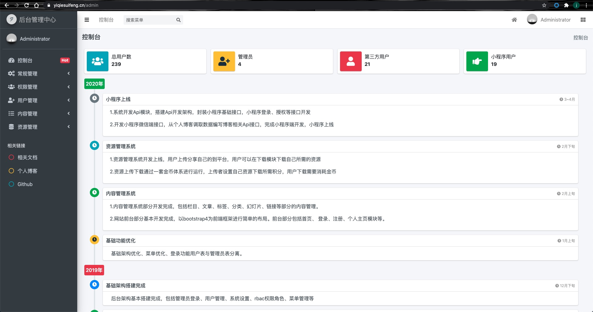

# Laradmin

基于laravel5.8，后台管理系统



## Getting Started | 快速开始

### Requirements | 环境要求

##### Server Requirements

- PHP >= 7.1.3
- PHP OpenSSL
- PHP PDO
- PHP Mbstring
- PHP Tokenizer
- PHP XML
- PHP Ctype
- PHP JSON

##### Development requirements

- composer
- nginx|apache
- mysql5.7+
- php7.0+
- nmp（选装）

### Installation | 安装

##### clone

```
git clone https://github.com/johncxf/laradmin.git
```

##### composer

```
composer install
```

### Configuration | 配置

#### .env

##### 创建`.env`文件

```
cp .env.example .env
```

##### 生成`APP_KEY`

```
php artisan key:generate
```

#### 数据库

##### 创建数据库

建议：在自己的环境创建数据库`laradmin`，字符集为： `utf8mb4_unicode_ci `，数据库引擎：`InnoDB`

##### 配置数据库连接

修改`.env`文件的数据库配置为本地数据库的配置

```
# 主数据库
DB_CONNECTION=mysql
DB_HOST=127.0.0.1
DB_PORT=3306
DB_DATABASE=laradmin
DB_USERNAME=root
DB_PASSWORD=root

# laradmin数据库，项目中现在使用这个数据库配置
DB_CONNECTION=mysql
DB_PORT_LARADMIN=3306
DB_DATABASE_LARADMIN=laradmin
DB_USERNAME_LARADMIN=root
DB_PASSWORD_LARADMIN=root
```

具体的配置可以自己修改`config/database.php`文件

##### 数据迁移

```
php artisan migrate:refresh
```

##### 数据填充

```
php artisan db:seed
```

#### Web服务器

根据实际需求进行web服务器配置，nginx、apache均可

## Usage | 用法

部署完成在浏览器中通过 `http://localhost:port`|`域名` 即可访问应用

**其余相关文档可以参考`doc`目录**

## Discussion | 讨论

#### 数据库版本过低

laravel要求msql环境为5.7.7以上版本，如果本地开发环境mysql版本未达到要求，需要在`App\Providers\AppServiceProvider.php`文件配置

```php
public function boot()
{
    // mysql版本低于5.7.7
    \Schema::defaultStringLength(191);
}
```

#### npm 安装前端扩展

```
npm i
```

### Extension | 扩展

#### 后端

| 扩展包               | 简介                 | 应用场景               |
| -------------------- | -------------------- | ---------------------- |
| caouecs/laravel-lang | 语言包，composer安装 | 使用了其中的中文语言包 |
| mews/captcha         | 验证码               | 登录验证码             |
| tymon/jwt-auth       | api接口认证          | api接口认证使用        |
| dingo/api            | api接口              | api接口使用类库        |
| spatie/laravel-pjax  | pjax                 | 后台管理菜单           |
| ...                  |                      |                        |

#### 前端

| 扩展包           | 简介               | 应用场景           |
| ---------------- | ------------------ | ------------------ |
| admin-lte        | 后台管理主要UI框架 | 后台管理主要UI框架 |
| bootstrap        | 前端框架           | 后台管理           |
| jquery           | js框架             | 整个项目           |
| treeTable        | jquery插件         | 树形菜单前端展示   |
| ajaxFrom         | jquery插件         | ajax表单提交       |
| airDialog        | jquery插件         | 提示弹出框         |
| jquery-pjax      | jquery插件         | 后台菜单           |
| lrz              | 前端图片压缩       | 图片上传           |
| summernote       | 富文本编译器       | 撰写文章           |
| swiper           | 轮播图             | 前台首页           |
| toastr           | 提示弹窗           | 后台所有提示       |
| fontawesome-free | 图标库             | 图标库             |
| icheck-bootstrap | 复选框             | 复选框             |
